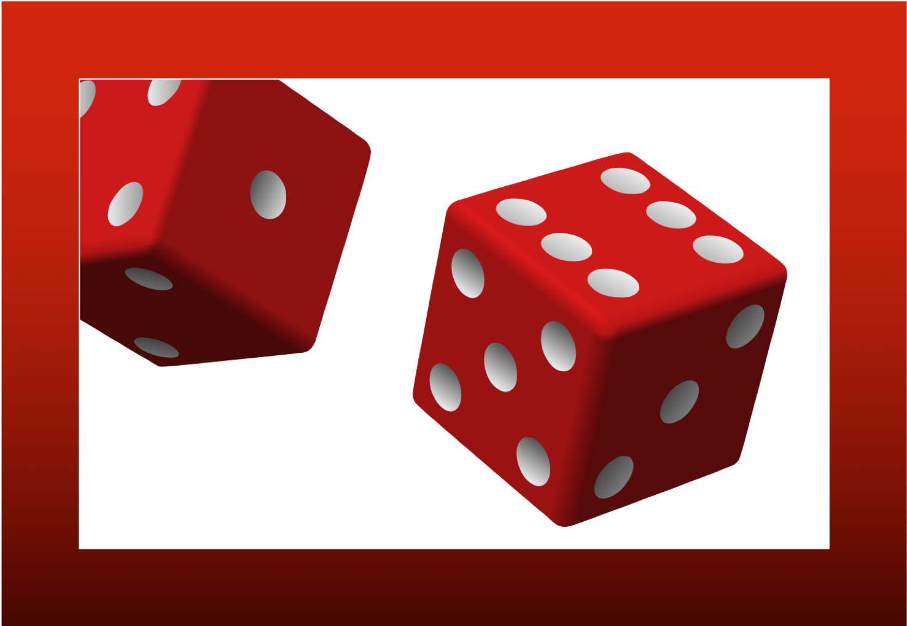
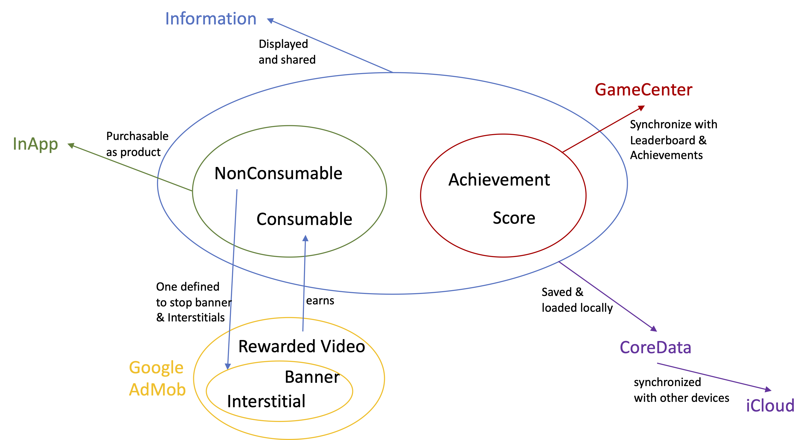
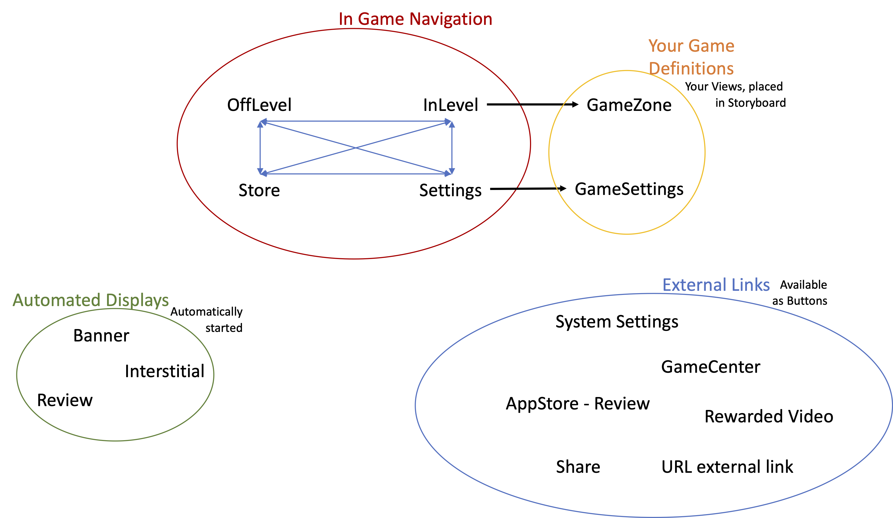

# **GameFrame**
All your iOS game needs. Apart from the game.

**GameFrame** is a FrameWork, that implements all the nitty-gritty code-snippets for InApp purchases, GameCenter, synchronization of CoreData and iCloud, advertisements, player reviews and more. You can simply add it to your project and design and develop your game idea.

Implementing all the named features is necessary to earn money with the App but often not the first priority. Learning how it works means to read a lot of documentation - often ending in a few lines of code for each.
I read all the documents, ran through deploying Apps based on the extracted code and bundled it then in this FrameWork.

## What you get
**GameFrame** follows a simple information model and provides configurable-standard navigations for easy user experience. Additionally it provides two ways to earn money with your game: (1) by adding products, purchasable via in-ap purchases and (2) via adertisements with banners, interstitials and rewarded videos.

### Information
There're four kinds of information items that are defined in `GameFrameKit`.

**GameFrame** defines `Achievement` and `Score` as explained in [GameCenter Programming Guide](https://developer.apple.com/documentation/gamekit) where a **GameFrame** `Achievement` relates to a GameCenter Achievement and a **GameFrame** `Score` relates to a GameCenter Leaderboard.

For In-App purchases, **GameFrame** defines `Consumable` and `NonConsumable` in the way, they're described in [StoreKit In-App Purchase](https://developer.apple.com/documentation/storekit/in-app_purchase)

These items are maintained, reported and interacted throughout the game in many differnt ways. The following picture illustrates how they relate and interact with different serices on iOS.

### Navigation
**GameFrame** and the `GameUIKit` provide a standard UX and flow through the various screens of a game. The also provide a number of buttons with predefined behaviour, that can be used in the game to include all the recurring features, that let a game get viral.

## What you have to add to make it *your* game
The idea is, that you can focus on the game itself. Its logic, design and spirit. But let's start right away.
1. Download, compile and run: Download this project, open it with XCode, build and run it. See, what you get. Try to press the buttons and navigate through "The Game", which is a ficitve game. Well, it has four buttons that change the values of information items. But its purpose is, to show how to work with **GameFrame**.
2. Have a short look at, what you got: **GameFrame** and the downloaded project conssist of three modules:
  * `GameFrameKit`: Lowest level. Implements the information items and handling in GameCenter, StoreKit, AdMob, CoreData, iCloud.
  * `GameUIKit`: Defines the navigation and players experience in the game.
  * `TheGame` finally is the test and sample implementation of a game, based on **GameFrame**. Use this as your starting point and reference on how to work with **GameFrame**
3. Change "The Game" to make it yours. There're different touch points, where you customize or define your game.

| Name | Description | Defintion | Example |
|--------|--------|--------|--------|
| Skin | Colors, fonts, transitions, animations and positioning of elements. All the look. It consits of about 40 functions, that can be overridden and which return `ViewModifier`. Modifiers are used everywhere in `GameUIKit` and have a default implementation. As you can see in the example, you need to override only the ones that you need | [GameSkin.swift](./TheGame/GameUIKit/Protocols/GameSkin.swift) | [TheGameSkin.swift](./TheGame/TheGame/Customization/TheGameSkin.swift) |
| Configuration | Defines aspects what navigation and information items are presented to the player during the game and with the share button. You also place your AdMob-Ids in the configuration and if the player should explicitely press a play-button to start the game (useful for Arcade games and games with timing) or if, the game starts right away without extra button to press (useful for puzzles or games like chess) | [GameConfig.swift](./TheGame/GameUIKit/Protocols/GameConfig.swift) | [TheGameConfig.swift](./TheGame/TheGame/Customization/TheGameConfig.swift) |
| Delegate | This is, where **GameFrame** asks your game for logic. You define here, what to do when a level starts or ends, when the player leaves the app or comes back. You also define if an adHoc offer should be displayed to the player, etc. | [GameDelegate.swift](./TheGame/GameUIKit/Protocols/GameDelegate.swift) | [TheGameDelegate.swift](./TheGame/TheGame/Customization/TheGameDelegate.swift) |
| GameZoneView | Here's your game! The view is implemented as an `EmptyView` with a `ViewModifier`. Define, what view should be shown in the modifier `getInLevelGameZoneModifier(...)` which gets the sizes of the view and the sizes of the overlaying information and navigation, you define in `GameConfig` | - | [TheGameView.swift](./TheGame/TheGame/Customization/TheGameView.swift) /  [TheGameSkin.swift@getInLevelGameZoneModifier(...)](./TheGame/TheGame/Customization/TheGameSkin.swift) |
| SettingsView | One more view you can add. The modifier is `getSettingsSpaceModifier(...)` and is part of the settings, that the user can see. It is meant for game specific settings like choosing an avatar or a game difficulty | - | [TheGameSettingsView.swift](./TheGame/TheGame/Customization/TheGameSettingsView.swift) /  [TheGameSkin.swift@getSettingsSpaceModifier(...)](./TheGame/TheGame/Customization/TheGameSkin.swift) |

## Checklist to setup a project with full featured **GameFrame**
This is a list of things, I came across during developing games - and always forget. It's surely not complete. After you installed and started to develop your game you have to interact with these things:
- [ ] [iTunesConnect](https://itunesconnect.apple.com/login) is the place to register your App with Apple, define products for in-app purchases, leaderboards and achievements for the GameCenter. Inform **GameFrame** about the defined information items in the `GameConfig`file to associate in-app products with corresponding `consumable`and `nonConsumable`. for Leaderboards and Achievements make sure, you use the same ID for the item in GameCenter as for the item in **GameFrame**
- [ ] [Google AdMob](https://developers.google.com/admob/ios/quick-start) to create an account and register your App with banners, interstitials and rewarded videos. You get an ID for each. Put these ID's into the `info.plist` and the `GameConfig`
- [ ] For [info.plist](./TheGame/TheGame/info.plist) I'd recommend two more entries: `Bundle display name` to give your game a nice name and `Privacy - Photo Library Additions Usage Description` to enable, that during sharing, when the player chooses to save the screenshot, he/she is asked for permission - instead of the app crashing.

## Checklist to deploy ready implemented App
You're ready to go? Did all the implementation? It's tested? It's profiled and performance tuned?

Then, let's go!

Here's a list of things, that probably need to be done now before deployment. 
- [ ] In `AppDelegate.swift`, function `application(...didFinishLaunchingWithOptions...)` add the line `maxLogLevel = 0` to save performance and do not write log-messages (not even generating them)
- [ ] In your call to `GameFrame.createSharedInstance()` (probably in `SceneDelegate.swift`) change the `adUnitIdXXXXX` parameters to the values, that Google has provided to you for banners, interstitials and rewarded videos.
- [ ] In the iCloud-Dashboard deploy the schema of your Container to production
- [ ] Build for Release
- [ ] Retest this. I've seen more then often, that the Debug-Compilation did work, but the Release not.
- [ ] Take a deep breath... Still sure? Yes? Then...
- [ ] Deploy

## More good readings
At least some, that I like and helped me.
- [40 secrets to make money with in-app-purchases](https://www.raywenderlich.com/2700-40-secrets-to-making-money-with-in-app-purchases)
